# Sistema de Gerenciamento de Pedidos  

Este é um sistema simples de gerenciamento de pedidos para um estabelecimento comercial. O sistema permite gerenciar produtos, pedidos e pagamentos, com funcionalidades para aplicar promoções e calcular troco.

---

## Funcionalidades

- **Gerenciamento de Produtos**
  - Cadastro de produtos
  - Atualização de estoque
  - Busca de produtos por nome e categoria
  - Remoção de produtos
- **Gerenciamento de Pedidos**
  - Criação de pedidos com múltiplos itens
  - Atualização do status do pedido
  - Remoção de itens do pedido
  - Listagem de todos os pedidos
- **Processamento de Pagamentos**
  - Processamento de pagamentos em dinheiro, cartão de crédito, cartão de débito e PIX
  - Aplicação de descontos promocionais
  - Cálculo de troco
  - Armazenamento de pagamentos em memória

---

## Estrutura do Projeto

```mermaid
graph TD
  A[enums] -->|CategoriaProduto.java| B
  A[enums] -->|FormaPagamento.java| C
  A[enums] -->|StatusPedido.java| D
  E[exception] -->|EstoqueInsuficienteException.java| F
  E[exception] -->|PagamentoNaoConfirmadoException.java| G
  E[exception] -->|PrecoNegativoException.java| H
  E[exception] -->|ProdutoNegativoException.java| I
  J[interfaces] -->|IPagamentoRepository.java| K
  L[model] -->|GerenciadorTroco.java| M
  L[model] -->|ItemPedido.java| N
  L[model] -->|Pagamento.java| O
  L[model] -->|Pedido.java| P
  L[model] -->|Produto.java| Q
  L[model] -->|Promocoes.java| R
  S[repository] -->|memory| T
  T -->|PagamentoMemoryRepository.java| U
  T -->|PedidoMemoryRepository.java| V
  T -->|ProdutoMemoryRepository.java| W
  X[service] -->|PagamentoService.java| Y
  X[service] -->|PedidoService.java| Z
  X[service] -->|ProcessadorDePagamento.java| AA
  X[service] -->|ProdutoService.java| AB
  AC[main] -->|Main.java| AD
```



---

## Como Usar

### Inicialização

Para iniciar o sistema, você pode usar a classe `Main` no pacote `main`. A classe `Main` inclui exemplos de como cadastrar produtos, criar pedidos e processar pagamentos.

---

### Ativar ou Desativar Promoção

Para ativar ou desativar a promoção, use o método `setPromocaoAtiva` da classe `Pagamento`.

```java
Pagamento pagamento = new Pagamento(FormaPagamento.DINHEIRO);
pagamento.setPromocaoAtiva(true);  // Ativar promoção
pagamento.setPromocaoAtiva(false); // Desativar promoção
```

---

### Inicializar o Valor do Caixa

Para inicializar o valor do caixa, use a classe `GerenciadorTroco`.

```java
GerenciadorTroco gerenciadorTroco = new GerenciadorTroco();
gerenciadorTroco.atualizarCaixa(100.00, 0.00); // Inicializa o caixa com R$ 100,00
System.out.println("Valor inicial em caixa: R$ " + gerenciadorTroco.getTotalDisponivel());
```

---

### Processar Pagamentos

Para processar pagamentos, use a classe `PagamentoService`.

```java
Pagamento pagamento = new Pagamento(FormaPagamento.DINHEIRO);
double valorPago = pagamentoService.processarPagamento(pagamento, pedido, valorRecebido, gerenciadorTroco, promocoes);
System.out.println("Valor pago: R$ " + String.format("%.2f", valorPago));
```

---

## Tecnologias Utilizadas

- **Java**
- **JUnit** (para testes unitários)

---

## Como Contribuir

1. Faça um fork do projeto.
2. Crie uma branch para sua feature:
   ```bash
   git checkout -b feature/nova-feature
   ```
3. Faça commit das suas alterações:
   ```bash
   git commit -m 'Adicionando nova feature'
   ```
4. Envie para o branch:
   ```bash
   git push origin feature/nova-feature
   ```
5. Abra um Pull Request.

---

## Licença

Este projeto está licenciado sob a Licença MIT. Veja o arquivo [LICENSE](https://opensource.org/licenses/MIT) para mais detalhes.

---

## Autor

- [GitHub - Jeferson Matos](https://github.com/JefersonMatos9)
- [LinkedIn - Jeferson Matos](https://www.linkedin.com/in/jeferson-matos/)
- [WhatsApp](https://wa.me/5516996072217)
